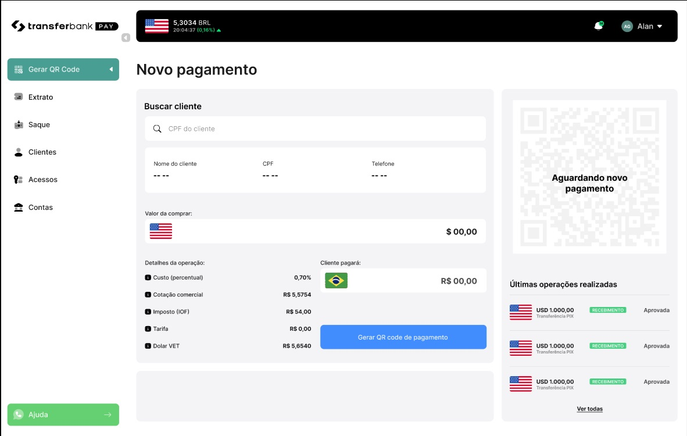
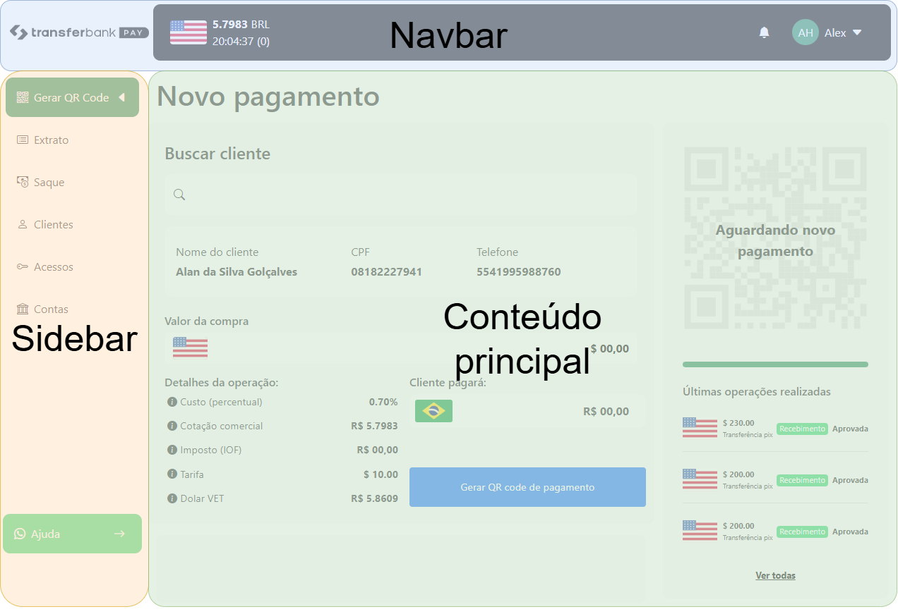
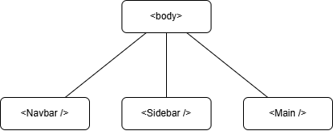

# 1 - Índice

- [1 - Índice](#1---índice)
- [2 - Introdução](#2---introdução)
- [3 - Intalação e configuração inicial](#3---intalação-e-configuração-inicial)
- [4 - Solução](#4---solução)
  - [4.1 - Estrutura da página](#41---estrutura-da-página)
    - [4.1.1 - Navbar](#411---navbar)
    - [4.1.2 - Sidebar](#412---sidebar)
    - [4.1.3 - Main](#413---main)
      - [4.1.3.1 - Atualizando o valor da cobrança](#4131---atualizando-o-valor-da-cobrança)
      - [4.1.3.2 - Criando uma cobrança](#4132---criando-uma-cobrança)
      - [4.1.3.3 - Mais sobre o Main](#4133---mais-sobre-o-main)
- [5 - Conclusão](#5---conclusão)

# 2 - Introdução

Neste projeto tive que modelar a seguinte tela:



Nela, um possivel cliente criaria uma ordem de cobrança, inserindo um valor em dolar que então seria convertido para reais. Em seguida um QR code com as informações do PIX seria criado, apareceria na tela junto a uma barra de progresso. Após a confirmação do pagamento, este vai para o histórico, dentro da barra lateral direita, na seção "Últimas operações realizadas".

As técnologias usadas foram [Vue.js](https://vuejs.org/), [Pinia](https://pinia.vuejs.org/) e [Bootstrap](https://getbootstrap.com/). Como a única exigencia para o back-end era a persistência dos dados, foi utilizado o pacote [`json-server`](https://www.npmjs.com/package/json-server).

# 3 - Intalação e configuração inicial

Para abrir o projeto, devemos rodar um servidor Vue.js. Para isso, dentro da pasta "/desafio-transferbank", rodar o seguinte comando:

```bash
npm install
```

Agora precisamos o `json-server`, para isso é necessário apontar o caminho do arquivo que será utilizado para a persistência dos dados:

```bash
json-server --watch data/db.json
```

Caso de erro, tente insta-lo globalmWente:

```bash
npm i -g json-server
```

Com isso pronto, podemos iniciar o Vue.js:

```bash
npm run serve
```

Feito isso, podemos acessar a página pelo navegador: [http://localhost:8080/](http://localhost:8080/).

# 4 - Solução

Bom, dentro do desafio tinhamos alguns requisitos a serem cumpridos. Alguns foram feitos com sucesso, outros, por uma questão de falta de tempo, não foram concluidos. Neste tópico irei abordar a estrutura, como solucionei alguns desses requisitos, e como solucionaria os desafios seguintes.

## 4.1 - Estrutura da página

Podemos dividir a página em 3 partes principais:



Eu acredito que o logo do transferbak, no canto superior esquerdo, caberia perfeitamente na sidebar também, mas achei mais adequado coloca-lo dentro da navbar.

Tendo isso em vista, eu imaginei 3 componentes principais para o desafio, e colocaria eles desta maneira no projeto:



Sendo que, idealmente o componente `<Main />` seria nossa view, utilizando o router para manipular o que esta sendo exibido para o usuário. Não cheguei a colocar o router, pois não era um requisito, mas no projeto eu adotaria esta linha.

> O único requisito para o projeto era a o que hoje pode ser visto no componente `<Main />`. Mas decidi fazer tanto a <Navbar /> quanto a <Sidebar /> para fins de estudo, tanto do Vue, como do Bootstrap e do Pinia, como irei abordar na sequência.

Agora vamos analisar como cada componente foi realizado.

### 4.1.1 - Navbar

A navbar não era um dos requisitos, mas ela serviu para entender alguns conceitos importantes. Aqui o principal foco foi em entender o funcionamento do Bootstrap, a navbar foi dividida em 2 áreas, o logo e o conteúdo:

```html
<nav class="navbar navbar-light mb-3">
  <div class="container-fluid column">
    <div class="col-2 g-0">...</div>
    <div class="col-10 p-3 d-flex justify-content-between...">...</div>
  </div>
</nav>
```

Aqui usamos as colunas do Bootsrap, alocando 2 para a logo as outras 10 para o conteúdo. Dessa maneira obtive um resultado muito próximo ao solicitado.

Dentro da parte que motra o conteúdo temos, a esquerda, a bandeira americana, a cotação do dólar, horário e a taxa de variação, exibindo se ela foi positiva ou negativa. A cotação e variáção eu decidi deixar em tempo real, pois serviu de estudo para o pinia, `fetch` dentro do vue, etc... Vamos ver como essa parte do código funciona. Temos a parte que esta dentro do `<template>`

```html
...
<div><span class="fw-bold">{{ coinConversion.ratio }}</span> BRL</div>
<div>
  20:04:37
  <span :class="variationStyle"
    >({{ coinConversion.variation }}) <i :class="variationIcon"></i
  ></span>
</div>
...
```

Aqui temos a conversão sendo exibida e, na linha seguinte, a taxa de variação com o respectivo ícone. Utilizamos variáveis para tudo, elas estão vindo de uma store do Pinia que armazena a cotação e variação, além do que esta dentro do `<script>`, que vai determinar algumas coisas sobre como a taxa será exibida, vamos olhar como isso foi montado, comneçando pelo `<script>`:

```jsx
...
import { useCoinConversion } from "../stores/CoinConversionStore";

export default {
  name: "Navbar",
  setup() {
    const coinConversion = useCoinConversion();
    let variationIcon = ref("");
    let variationStyle = ref("");

    watchEffect(() => {
      if (parseFloat(coinConversion.variation) > 0) {
        variationIcon.value = "bi bi-caret-up-fill";
        variationStyle.value = "text-success";
      } else if (parseFloat(coinConversion.variation) < 0) {
        variationIcon.value = "bi bi-caret-down-fill";
        variationStyle.value = "text-danger";
      } else {
        variationIcon.value = "";
        variationStyle.value = "text-light";
      }
    });

    return { coinConversion, variationIcon, variationStyle };
  },
};
```

Usamos duas `ref()`'s para controlar o ícone, a primeira é qual será o ícone e, a segunda, de que cor ele será. Podemos ver como essa decisão é feita dentro do bloco `if/else`, se a taxa for positiva exibimos uma seta para cima, com tudo verde e, se for negativa, uma seta para baixo com tudo vermelho. Caso não haja uma variação, não é exibido nenhum ícone. E tudo isso dentro de um `watchEffect()`, que irá ficar monitorando os valores das variáveis que estão dentro dele.

A Store que armazena essas informações é bem simples:

```js
import { defineStore } from "pinia";

export const useCoinConversion = defineStore("coinConversionStore", {
  state: () => ({
    coinin: "BRL",
    coinout: "USD",
    ratio: "----",
    variation: "--",
  }),
  actions: {
    async getConversion() {
      try {
        const res = await fetch(
          `https://economia.awesomeapi.com.br/json/last/${this.coinout}-${this.coinin}`
        );
        const data = await res.json();
        this.ratio = (data.USDBRL.bid + "0000").slice(0, 6);
        this.variation = data.USDBRL.pctChange;
      } catch (e) {
        this.ratio = "----";
        this.variation = "--";
      }
    },
  },
});
```

Aqui eu deixei a moeda de origem e destino em aberto, dessa maneira, dependendo da origem do usuário ou interesse em alguma outra moeda, poderíamos mudar essas variáveis e exibir diferentes cotações para ele.

Utilizei uma API pública para obter a cotação. Depois que a cotação é obtida, a gente converte ela para uma string, adiciona alguns zeros e, por fim, cortamos ela, desta maneira podemos garantir que teremos sempre um dólar exibido com 4 casas decimais. Por fim, temos um código para, caso a gente não obtenha resposta da API, não será exibida nenhuma cotação para o usuário.

Esses dados são carregados dentro da parte principal da aplicação. Como essa cotação é utilizada em toda o site, achei interessante colocar esse elemento no componente que é responsável por todos os outros. O código em si é muito simples:

```js
...
setInterval(() => {
    coinConversion.getConversion();
}, 30000);
...
```

Utilizei um `setInterval()` para atualizar o valor da cotação a cada 30 segundos, algo que considerei adequado.

### 4.1.2 - Sidebar

Esse componente é bem simples, idealmente ele iria controlar a parte principal da tela, exibindo o que o usuário esta requisitando naquele momento. Única coisa que fiz de diferente foi colocar um efeito de _hover_ nos ícones. Os elementos dela são exibidos a partir de uma lista de ícones:

```html
<ul class="nav nav-pills flex-column mb-auto">
  <li v-for="option in sidebarOptions" :key="option.name">
    <SidebarOption :option="option" />
  </li>
</ul>
```

Para isso utilizei a função de `v-for` do Vue para iterar sobre uma lista que foi determinada dentro do `<script>`:

```js
...
const sidebarOptions = ref([
    { name: "Gerar QR Code", icon: "bi bi-qr-code", isSelected: true },
    { name: "Extrato", icon: "bi bi-card-list", isSelected: false },
    { name: "Saque", icon: "bi bi-cash-coin", isSelected: false },
    { name: "Clientes", icon: "bi bi-person", isSelected: false },
    { name: "Acessos", icon: "bi bi-key", isSelected: false },
    { name: "Contas", icon: "bi bi-bank", isSelected: false },
]);
...
```

Dessa maneira poderíamos adicionar facilmente novas funcionalidades ao site, bastando incrementar essa lista com um novo elemento.

Como a gente pode ver, utilizamos outro componente, o `<SidebarOption />`, nele temos dois elementos possiveis:

```html
<template>
  <div
    class="p-3 me-0 mb-1 bg-success text-light d-flex justify-content-between border-radius-default"
    style="width: 100%"
    v-if="option.isSelected"
  >
    <div><i class="me-2" :class="option.icon"></i>{{ option.name }}</div>
    <div><i class="bi bi-caret-left-fill"></i></div>
  </div>
  <div
    class="p-3 me-0 mb-1 border-radius-default"
    style="width: 100%"
    v-else
    @mouseover="mouseIn"
    @mouseleave="mouseOut"
    :class="mouseOverClass"
  >
    <div><i class="me-2" :class="option.icon"></i>{{ option.name }}</div>
  </div>
</template>
```

Para decidir qual será exibido, a renderização condicional do Vue.js, utilizando o `v-if/v-else`. A diferença é a cor e que o ícone selecionado recebe uma pequena seta para indicar em qual opção o usuário esta.

### 4.1.3 - Main

Agora chegamos a estrela do show, o componente principal do desafio. Aqui nós precisamos apresentar informações importantes para o usuário:

- Informações do cliente
- Valor da cobrança
- Cotação
- Taxas
- Valor final da cobrança
- QR code de pagamento
- Barra de carregamento
- Histórico recente

Vamos primeiro entender como funciona o fluxo principal da aplicação:

<style type="text/css">
.tg  {border-collapse:collapse;border-spacing:0;}
.tg td{border-color:black;border-style:solid;border-width:1px;font-family:Arial, sans-serif;font-size:14px;
  overflow:hidden;padding:10px 5px;word-break:normal;}
.tg th{border-color:black;border-style:solid;border-width:1px;font-family:Arial, sans-serif;font-size:14px;
  font-weight:normal;overflow:hidden;padding:10px 5px;word-break:normal;}
.tg .tg-wp8o{border-color:#000000;text-align:center;vertical-align:top}
.tg .tg-mqa1{border-color:#000000;font-weight:bold;text-align:center;vertical-align:top}
.tg .tg-73oq{border-color:#000000;text-align:left;vertical-align:top}
</style>
<table class="tg"><thead>
  <tr>
    <th class="tg-mqa1" colspan="2">Fluxo principal</th>
  </tr></thead>
<tbody>
  <tr>
    <td class="tg-mqa1">Ações do Ator</td>
    <td class="tg-mqa1">Ações do sistema</td>
  </tr>
  <tr>
    <td class="tg-wp8o">P-1: Usuário insere o CPF do cliente</td>
    <td class="tg-wp8o"></td>
  </tr>
  <tr>
    <td class="tg-wp8o"></td>
    <td class="tg-wp8o">P-2: Sistema exibe as informações do cliente</td>
  </tr>
  <tr>
    <td class="tg-73oq">P-3: Usuário seleciona o cliente</td>
    <td class="tg-73oq"></td>
  </tr>
  <tr>
    <td class="tg-73oq"></td>
    <td class="tg-73oq">P-4: Sistema carrega as informações do cliente na tela</td>
  </tr>
  <tr>
    <td class="tg-73oq">P-5: Usuário informa o valor da cobrança</td>
    <td class="tg-73oq"></td>
  </tr>
  <tr>
    <td class="tg-73oq"></td>
    <td class="tg-73oq">P-6: Sistema exibe o valor das taxas e o valor final da cobrança</td>
  </tr>
  <tr>
    <td class="tg-73oq">P-7: Cliente seleciona a opção para gerar QR code</td>
    <td class="tg-73oq"></td>
  </tr>
  <tr>
    <td class="tg-73oq"></td>
    <td class="tg-73oq">P-8: Sistema exibe o QR code</td>
  </tr>
  <tr>
    <td class="tg-73oq"></td>
    <td class="tg-73oq">P-9: Sistema exibe a barra de carregamento</td>
  </tr>
  <tr>
    <td class="tg-73oq"></td>
    <td class="tg-73oq">P-10: Pagamento é confirmado</td>
  </tr>
  <tr>
    <td class="tg-73oq"></td>
    <td class="tg-73oq">P-11: Sistema exibe um modal confirmando o pagamento</td>
  </tr>
  <tr>
    <td class="tg-73oq"></td>
    <td class="tg-73oq">P-12: Sistema atualiza o histórico de transações</td>
  </tr>
</tbody></table>

Como são muitos elementos, vou focar em alguns principais.

#### 4.1.3.1 - Atualizando o valor da cobrança

Um dos passos mais importantes do processo é a inserção do valor cobrado e calculo do valor final da compra. Isso ocorre dentro do componente `<InfosNovoPagamento />`, nele nós capturamos o valor do input do usuário e usamos algumas `ref()`'s para exibir os valores atualizados para o usuário.

Para isso nós usamos o Pinia, isso permitiu que tudo fosse calculado de maneira bem simplificada. No componente `<InfosNovoPagamento />`, temos essa parte do código responsável por capturar e transmitir o valor inserido pelo usuário:

```jsx
export default {
  ...
  setup() {
    ...
    const transactionInfo = useTransactionInfo();
    let valueAmount = ref("");

    watch(valueAmount, () => {
      transactionInfo.setTransactionValue(valueAmount);
    });
    ...
};
```

Perceba como ficou simples, nós basicamente importamos a Store e carregamos o valor do `<input>` dentro da variável `valueAmount`. Em seguida nós usamos uma função `watch()` para monitorar o valor do `<input>` e atualizar o valor que esta armazenado na Store. Vamos então ver como ficou essa Store:

```js
export const useTransactionInfo = defineStore("transactioInfoStore", {
  state: () => ({
    transactionValueOriginal: 0,
  }),
  getters: {
    iofValue() {
      return 0.0038;
    },
    custoPercentual() {
      return 0.007;
    },
    transactionCharge() {
      return 10;
    },
    transactionChargeStr() {
      return (Math.round(this.transactionCharge * 100) / 100).toFixed(2);
    },
    custoPercentualStr() {
      return (Math.round(this.custoPercentual * 10000) / 100).toFixed(2);
    },
    iofAmount() {
      const coinConversion = useCoinConversion();
      if (this.transactionValueOriginal > 0) {
        console.log(this.iofValue);
        return (
          parseFloat(coinConversion.ratio * this.iofValue) *
          parseFloat(this.transactionValueOriginal)
        );
      }
      return "00,00";
    },
    iofAmountStr() {
      if (this.transactionValueOriginal > 0) {
        return (Math.round(this.iofAmount * 100) / 100).toFixed(2);
      }
      return "00,00";
    },
    dolarVETValue() {...},
    dolarVETValueStr() {...},
    transactionValueFinal() {...},
    transactionValueFinalStr() {...},
  },
  actions: {
    setTransactionValue(value) {
      this.transactionValueOriginal = parseFloat(value.value);
    },
  },
});
```

Veja que temos apenas um valor de estado dentro desta Store, `transactionValueOriginal`. Alguns outros valores como o IOF, custo e tarifa eu coloquei como _getters_, uma vez que eles não irão ser alterados durante o cálculo, eu fiz dessa maneira porque achei mais... Seguro desta maneira.

Em seguida temos algumas funções que realizam os cálculos, com uma responsável pelo valor e outra pelo valor como string. No final temos uma _action_, que é a responsável por alterar o valor da variável `transactionValueOriginal`.

Com isso, dentro do componente a gente acessava todos esses valores de maneira bem simples. Veja, por exemplo, como a gente obtia e exibia o valor final que seria cobrado do cliente:

```html
<div class="fw-bold d-flex align-items-center me-3">
  R$ {{ transactionInfo.transactionValueFinalStr }}
</div>
```

#### 4.1.3.2 - Criando uma cobrança

A partir do momento em que o cliente clicava na opção de gerar um código QR, uma série de etapas aconteciam dentro do app. Para que tudo fosse feito de maneira consistente, eu optei por criar uma Store especifica para as transações, desta maneira, mesmo que o valor da cotação do dólar sofresse alteração, o valor da transação, durante o tempo de processamento, não sofreria alteração, desta maneira poderíamos evitar eventuais inconsistências de cotação, uma vez que, confirmada a transação, nós não enviaríamos ao banco de dados o último valor do dólar, mas sim o valor do dólar no qual a transação foi calculada.

Para isso, dentro do componente `<InfosNovoPagamento />`, executamos esse trecho de código no momento em que o usuário clica para gerar o QR code:

```js
const startChargeProccess = () => {
  if (valueAmount.value != "") {
    buttonState.value = "cancelChargeOrder";
    transaction.createTransactionOrder({
      state: "payment",
      clientName: clientName.value,
      clientCPF: clientCPF.value,
      clientPhone: clientPhone.value,
      dolarValue: coinConversion.ratio,
      dolarVETValue: transactionInfo.dolarVETValue,
      finalOrderValue: valueAmount.value,
      finalOrderValueClient: transactionInfo.transactionValueFinal,
      type: "Pix",
      flow: "Inbound",
    });
  }
};
```

Primeiro a gente avalia se existe um valor digitado, caso positivo, prosseguimos com o código. Veja que aqui nós passamos várias informações para a Store _TransactionStore_, por isso que anteriormente nós tinhamos um valor em string e outro númérico, aqui nós utilizamos os valores numéricos.

Feito isso, nós exibimos o QR code para o usuário e desabilitamos os campos de entrada de valor. Caso ele clique em cancelar, a gente zera todos os valores da Store _TransactionStore_, retornamos o botão para a opção anterior, e habilitamos as entradas de valor.

#### 4.1.3.3 - Mais sobre o Main

Ademais, o componente exibe também o histórico, algo que é simples, usamos um fetch para buscar as últimas trasações, e um `v-for` para exibilas para o usuário. Temos também a barra de carregamento que, por mais que tenha exigido um esforço para localizar a solução, uma vez que a encontramos, sua implementação foi simplificada.

Faltou fazer a busca de usuários, minha ideia era esperar o usuário digitar um cpf completo e, com essa informação, relizar uma busca pelo CPF no banco de dados, caso positivo exibiria uma caixinha com os dados do usuário para ele selecionar e, feito isso, carregaria os valores na tela. Inclusive, já hávia deixado tudo como `ref()` para apenas receber esses valores e já conseguir exibir na tela.

Outro ponto que faltou foi a criação do QR code. Eu deixei tudo pronto para recebe-lo, bastaria localizar uma biblioteca para gera-lo e implementa-la na aplicação. Acredito que essa tarefa demandaria algumas horas...

Os Modais também faltaram, mais algumas horas eles teriam sido implementados de maneira adequada, pelo menos o de confirmação de pagamento.

Por fim, o que eu teria feito é alguma função para formatar o número de telefone e CPF do cliente, acredito que isso melhoraria a experiência visual da aplicação.

# 5 - Conclusão

O projeto no final ficou visualmente muito parecido ao solicitado e cumprindo requisitos importantes do que foi solicitado. Acredito que um pouco mais de tempo todos poderiam ter sido concluidos com exito.

Nessa breve introdução e exepriência do Vue.js, ele se provou uma ferramente bem interessante, com vantagens claras em relação a frameworks concorrentes. A _composition API_ foi de fato uma adição importante, pois permite agrupar o código em responsabilidades e, caso a gente prefira, ainda temos a opção de usar a _options API_.

Sobre o Bootstrap, ele facilita muito a construção de páginas. O sistema de grids dele permite que a gente divida melhor a página. Quando aliamos isso aos componentes do Vue, temos a possibilidade de construir uma página da web como um "Lego", um componente de cada vez e, na sequência, encaixando eles no grid.

E o Pinia, o que falar dele? Quando entrei na página dele eu vi aquele abacaxi e... A realidade é que ele facilitou muito toda a construção do site. Essa organização dos estados em Stores facilita muito tudo, a gente consegue acessar um estado de qualquer ponto da aplicação, dispensando problemas como prop drilling, e permitindo que tenhamos algo equivalente as propriedades computadas dentro dele.
